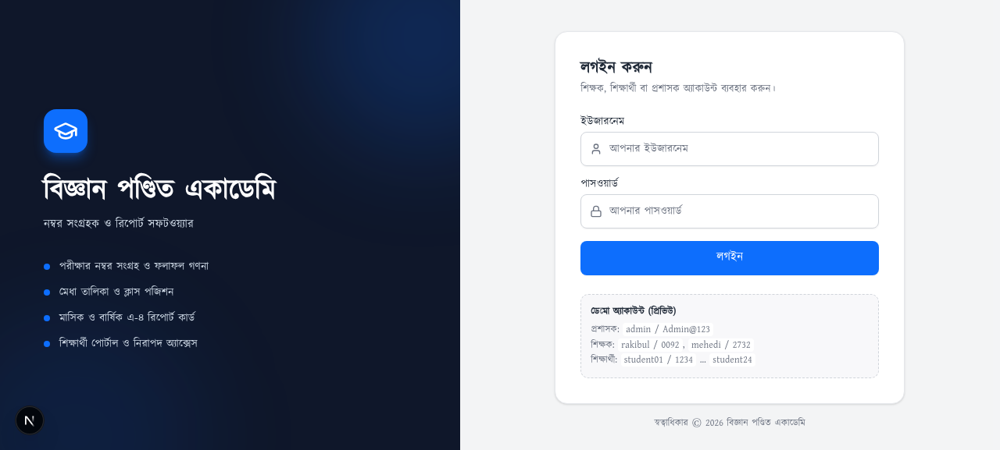
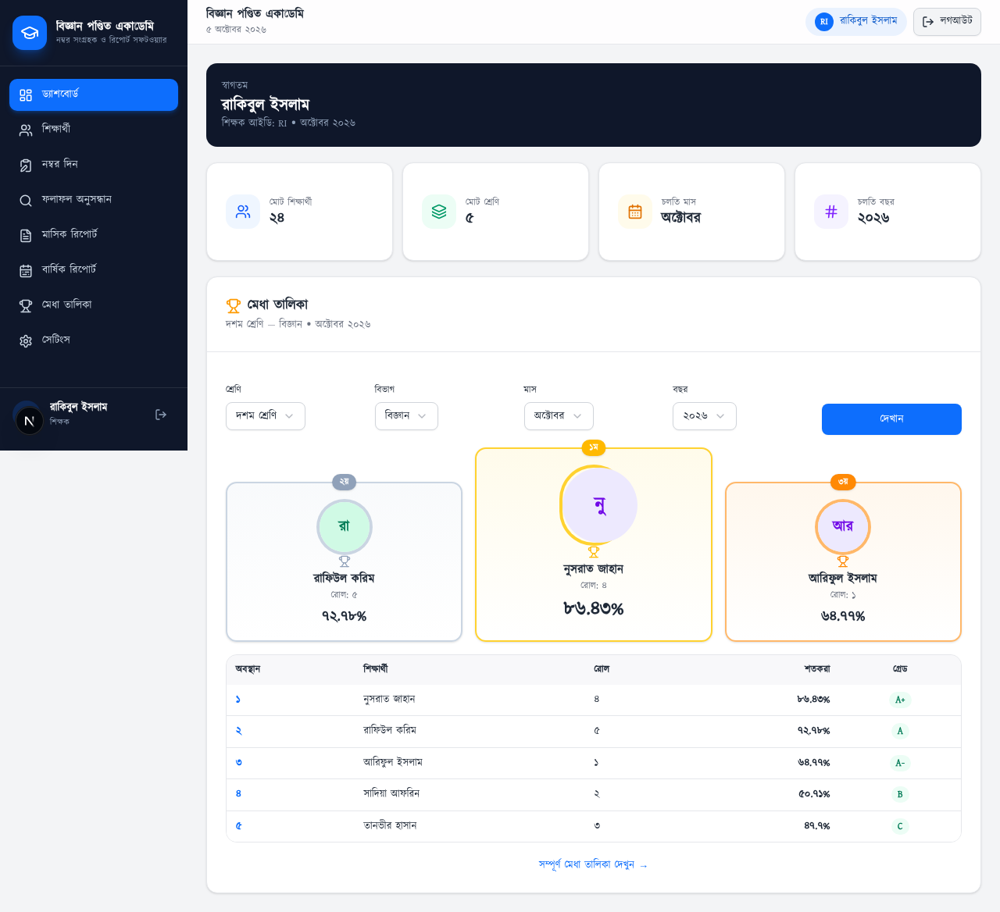
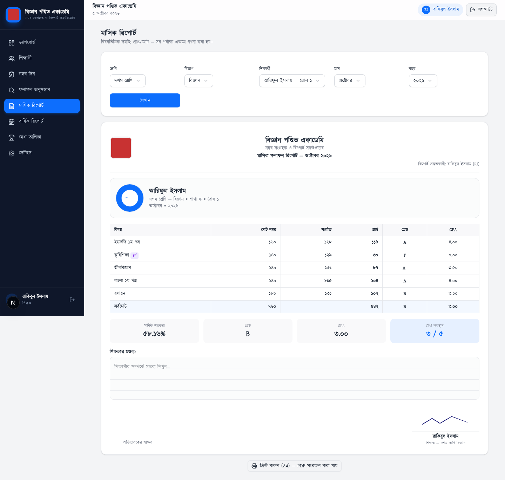
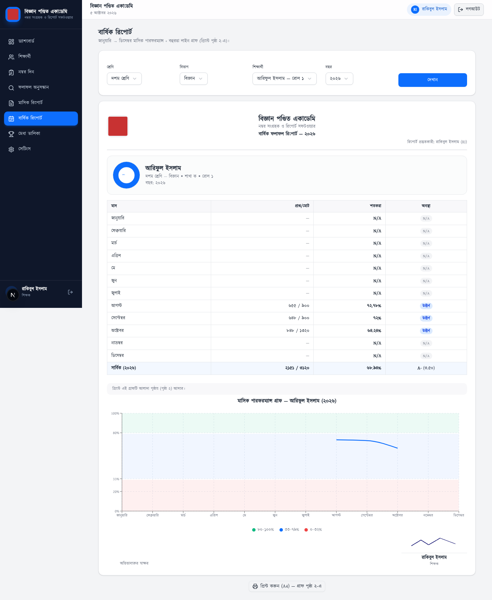
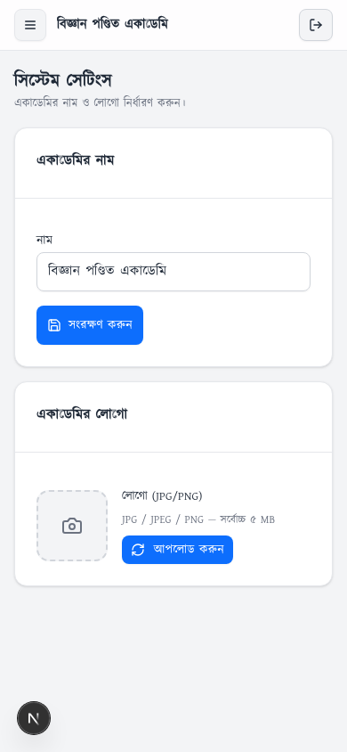
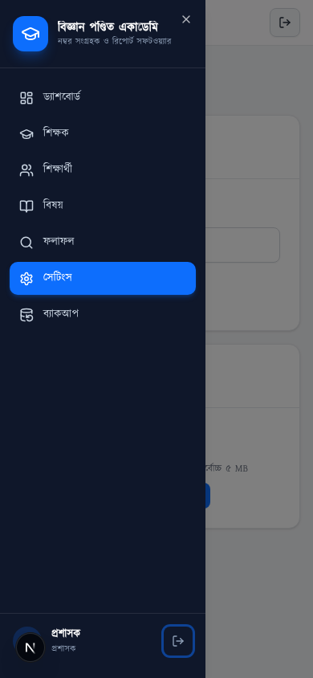

# বিজ্ঞান পণ্ডিত একাডেমি — নম্বর সংগ্রহক ও রিপোর্ট সফটওয়্যার

কোচিং সেন্টারের জন্য সম্পূর্ণ মার্কস কালেকশন, ফলাফল গণনা, মেধা তালিকা ও A4 রিপোর্ট প্রিন্টিং সিস্টেম।

**স্ট্যাক:** Next.js 16 (App Router) + TypeScript + Tailwind CSS 4 + shadcn/ui + Recharts, ব্যাকএন্ড সম্পূর্ণ **Cloudflare** — Workers (OpenNext) + D1 (SQLite) + R2 (ফাইল স্টোরেজ)। কোনো VPS / MySQL / MongoDB লাগে না।

   

## স্ক্রিনশট

| লগইন | ড্যাশবোর্ড (মেধা পডিয়াম) |
|---|---|
|  |  |

| মাসিক রিপোর্ট (A4) | বার্ষিক গ্রাফ (রঙ-জোন) |
|---|---|
|  |  |

| মোবাইল (৩৯০px) | মোবাইল ড্রয়ার |
|---|---|
|  |  |

## ফিচার

### ৩টি রোল — সার্ভার-সাইড অথরাইজেশন
- **প্রশাসক (ADMIN):** ড্যাশবোর্ড, শিক্ষক ব্যবস্থাপনা, শিক্ষার্থী ব্যবস্থাপনা, বিষয় ও অনুমতি, ফলাফল সংশোধক, সেটিংস (লোগো/সিগনেচার আপলোড), ব্যাকআপ/রিস্টোর
- **শিক্ষক (TEACHER):** নিজের বিষয়ে নম্বর এন্ট্রি (Save & Next), শিক্ষার্থী তালিকা, সার্চ ফলাফল, মাসিক/বার্ষিক রিপোর্ট, মেধা তালিকা
- **শিক্ষার্থী (STUDENT):** প্রোফাইল (ছবি সহ), নিজের ফলাফল, মাসিক ও বার্ষিক রিপোর্ট — শুধু নিজের ডেটা (IDOR সুরক্ষিত)

### নম্বর এন্ট্রি (মোবাইল-দ্রুত)
- শুধু যে বিষয়ে শিক্ষকের অনুমতি আছে সেটিই দেখায় (সার্ভারে পুনঃযাচাই)
- **Save & Next Student** — এন্টার চেপে পরের শিক্ষার্থী
- একই পরীক্ষায় ডুপ্লিকেট এন্ট্রি হলে বাংলায় কনফার্মেশন → আপডেট বা বাতিল
- অনুপস্থিত (absent) দিলে স্বয়ংক্রিয়ভাবে নম্বর ০

### রেজাল্ট ইঞ্জিন (একক মডিউল, সার্ভারে গণনা)
- শ্রেণিবিভাগ: ৮০–১০০ → A+ (৫.০০), ৭০–৭৯ → A (৪.০০), ৬০–৬৯ → A- (৩.৫০), ৫০–৫৯ → B (৩.০০), ৪০–৪৯ → C (২.০০), ৩৩–৩৯ → D (১.০০), ০–৩২ → F (০.০০)
- শতকরা = `SUM(প্রাপ্ত) / SUM(পূর্ণমান) × ১০০` — কখনোই শতকরার গড় নয়
- মেধা ক্রম: ১) শতকরা ২) মোট প্রাপ্ত ৩) GPA
- সব শতকরা/গ্রেড/GPA ক্লায়েন্ট থেকে আসা মান থেকে নেওয়া হয় না — সার্ভার নিজে গণনা করে

### রিপোর্ট ও প্রিন্ট
- **সার্চ ফলাফল:** যেকোনো শিক্ষার্থী, যেকোনো পরীক্ষা — শিক্ষক শুধু নিজের বিষয়ে
- **মাসিক রিপোর্ট:** বিষয়ভিত্তিক টেবিল + কমেন্ট বক্স + শিক্ষক সিগনেচার + একাডেমি লোগো (A4)
- **বার্ষিক রিপোর্ট:** মাস-ভিত্তিক টেবিল (পেজ ১) + বার্ষিক লাইন-গ্রাফ (পেজ ২) — ০–৩২% লাল / ৩৩–৭৯% নীল / ৮০–১০০% সবুজ জোন
- **মেধা তালিকা:** ক্লাস + বিভাগ + মাস ভিত্তিক র‍্যাংকিং, ডিফল্ট চলতি মাস + দশম শ্রেণি
- A4 প্রিন্ট CSS — ব্রাউজার থেকে Print → Save as PDF

### নিরাপত্তা
- PBKDF2-SHA256 পাসওয়ার্ড হ্যাশ (plain-text কোথাও নেই)
- HttpOnly + Secure + SameSite সেশন কুকি, D1 `sessions` টেবিল, এক্সপায়রি
- লগইন রেট-লিমিট, same-origin CSRF চেক
- সব পারমিশন D1 `teacher_subjects` থেকে সার্ভারে যাচাই — শুধু UI লুকানো নয়
- আপলোড ভ্যালিডেশন: JPG/PNG magic-byte যাচাই, সাইজ লিমিট

### ব্যাকআপ সিস্টেম
- এক ক্লিকে সম্পূর্ণ ডেটা এক্সপোর্ট → R2 (`academy/backups/`)
- ব্যাকআপ ডাউনলোড / রিস্টোর (অ্যাক্টিভ অ্যাডমিন সেশন সংরক্ষিত থাকে) / ডিলিট

## দ্রুত শুরু (লোকাল)

```bash
git clone https://github.com/ss04pp1-dotcom/bigganpondit.git
cd bigganpondit
bun install

# লোকাল env ফাইল তৈরি করুন (টেমপ্লেট দেখুন .dev.vars.example)
cp .dev.vars.example .dev.vars
# চাইলে ADMIN_PASSWORD / AUTH_SECRET বদলে নিন

bun run dev   # http://localhost:3000
```

প্রথম বুটে স্কিমা তৈরি ও সিকিউর সিড স্বয়ংক্রিয়ভাবে চলে (ক্লাস ৬–১০, বিষয়, শিক্ষক, ডেমো শিক্ষার্থী)। লোকাল মোডে D1-সামঞ্জস্যপূর্ণ SQLite (`db/academy.db`) ও R2-সামঞ্জস্যপূর্ণ ফাইলসিস্টেম (`.storage/r2/`) ব্যবহৃত হয়।

### প্রাথমিক অ্যাকাউন্ট (লোকাল/ডেমো)

| রোল | ইউজারনেম | পাসওয়ার্ড |
|---|---|---|
| প্রশাসক | `admin` | `.dev.vars`-এ নির্ধারিত (ডিফল্ট `Admin@123`) |
| শিক্ষক | `rakibul` | `0092` |
| শিক্ষক | `mehedi` | `2732` |
| শিক্ষার্থী | `student01` … `student24` | `1234` |

> প্রোডাকশনে ডেমো পাসওয়ার্ড অবশ্যই বদলাবেন এবং `DEMO_HINT=0` রাখবেন।

## ডিপ্লয়মেন্ট (Cloudflare)

বিস্তারিত ধাপে ধাপে গাইড: **[DEPLOY.md](DEPLOY.md)** — D1 তৈরি, মাইগ্রেশন, R2 বাকেট, সিক্রেট, `bun run deploy:cf`।

## পরীক্ষা (E2E)

```bash
bun run dev &                                    # সার্ভার চালু রাখুন
python3 scripts/e2e_api.py      # ২২টি API টেস্ট (auth, IDOR, marks, backup)
python3 scripts/e2e_pages.py    # ২৫টি পেজ টেস্ট (রোলভিত্তিক রুট, প্রিন্ট এরিয়া)
python3 scripts/deep_audit.py   # ৮১টি ডিপ অডিট (গ্রেড বাউন্ডারি, SUM/SUM, র‍্যাংকিং)
```

## প্রজেক্ট স্ট্রাকচার

```
src/
├── app/
│   ├── (auth)/login/          # লগইন (স্প্লিট স্ক্রিন)
│   ├── admin/                 # প্রশাসক প্যানেল (৭ পেজ)
│   ├── teacher/               # শিক্ষক (ড্যাশবোর্ড, নম্বর এন্ট্রি, রিপোর্ট, মেধা)
│   ├── student/               # শিক্ষার্থী পোর্টাল
│   └── api/                   # REST API (auth, students, marks, results, files, backup…)
├── components/                # UI কম্পোনেন্ট + AppShell (রেফারেন্স UI)
└── lib/
    ├── auth/                  # PBKDF2, সেশন, রোল গার্ড
    ├── db/                    # D1 লেয়ার + স্কিমা + সিড
    ├── results/               # রেজাল্ট ইঞ্জিন + রিপোর্ট অ্যাসেম্বলি
    ├── storage/               # R2 লেয়ার
    └── validation/            # ইনপুট যাচাই
db/migrations/                 # D1 মাইগ্রেশন (SQL)
docs/screenshots/              # স্ক্রিনশট
scripts/                       # E2E টেস্ট স্যুট
wrangler.toml                  # Cloudflare কনফিগ (Workers + D1 + R2)
```

## গ্রেডিং স্কেল

| নম্বর | গ্রেড | GPA |
|---|---|---|
| ৮০–১০০ | A+ | ৫.০০ |
| ৭০–৭৯ | A | ৪.০০ |
| ৬০–৬৯ | A- | ৩.৫০ |
| ৫০–৫৯ | B | ৩.০০ |
| ৪০–৪৯ | C | ২.০০ |
| ৩৩–৩৯ | D | ১.০০ |
| ০–৩২ | F | ০.০০ |

---

© বিজ্ঞান পণ্ডিত একাডেমি — সর্বস্বত্ব সংরক্ষিত।
